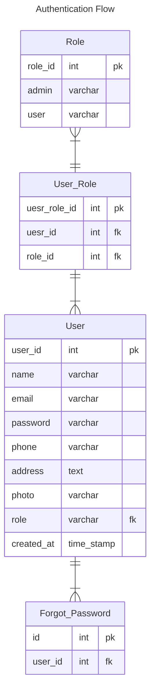

# Authentication Flow

```mermaid


---
title: Authentication Flow
---
erDiagram

    User {
        user_id int pk
        name varchar
        email varchar
        password varchar
        phone varchar
        address text
        photo varchar
        role varchar fk
        created_at time_stamp
    }

    Role }|--|| User_Role : ""
    Role {
        role_id int pk
        admin varchar
        user varchar
    }
    User_Role ||--|{User : ""
    User_Role {
        uesr_role_id int pk
        uesr_id int fk
        role_id int fk
    }
    
    User ||--|{ Forgot_Password : ""
    Forgot_Password {
        id int pk
        user_id int fk
    }

```
